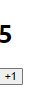

rsc + tab : react 코드 자동완성

rcc + tab : 클래스 코드 자동완성


#### 클래스형 컴포넌트의 state

```js
//Counter.js
import { Component } from 'react';

class Counter extends Component {
  constructor(props) {
    super(props)
    // state 값의 초깃값 설정하기
    this.state = {
      number: 0
    }
  }
  render() {
    const {number} = this.state //state를 조회할 때는 this.state로 조회
    return (
      <div>
        <h1>{number}</h1>
        <button
          //onClick을 통해 버튼이 클릭되었을 때 호출할 함수를 지정한다.
          onClick={() => {
            // this.setState를 사용해서 state에 새로운 값을 넣을 수 있음
            this.setState({number: number+1})
          }}
        >
          +1
        </button>
      </div>
    );
  }
}

export default Counter;
```

- constructor 메서드 
  
  - component 생성자 메서드
  
  - 반드시, super(props) 호출 → 현재 클래스형 컴포넌트가 상속받고 있는 리액트의 Component 클래스가 지닌 생성자 함수를 호출

- thist.state의 초깃값 설정
  
  - 컴포넌트의 state는 객체 형식이어야 함

- onClick은 props로 넣어줌
  
  - 이벤트로 설정할 함수는 화살표 함수 문법을 사용해야함
  
  - this.setState는 함수임
  
   

```js
//App.js
import Counter from "./Counter";

const App = () => {
  return <Counter />;
}

export default App;

```


#### 실행화면



- 누를 때마다 1씩 증가
